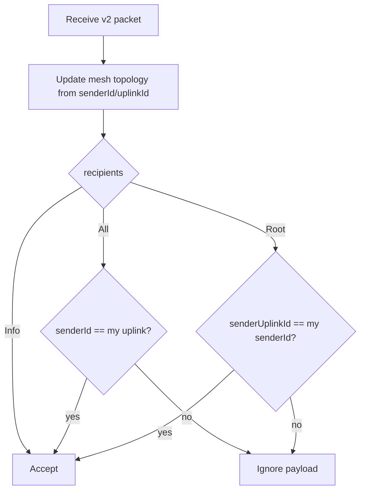
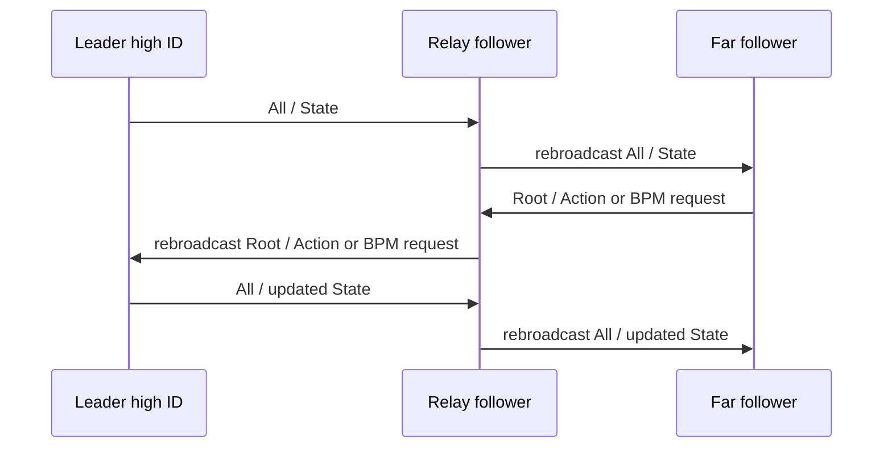
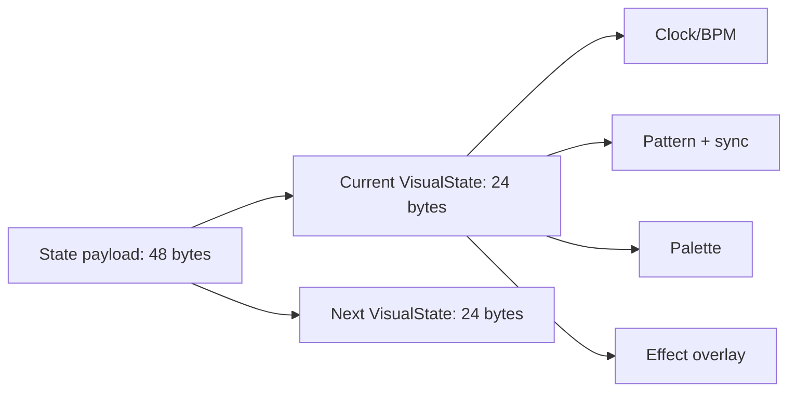
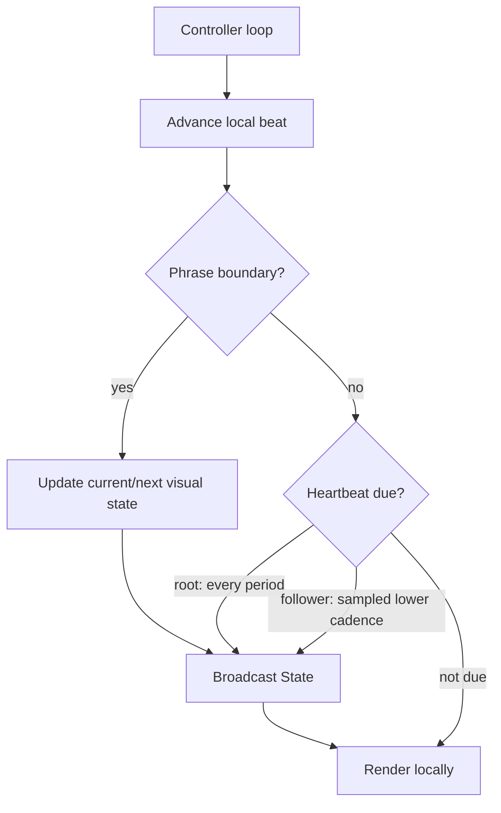
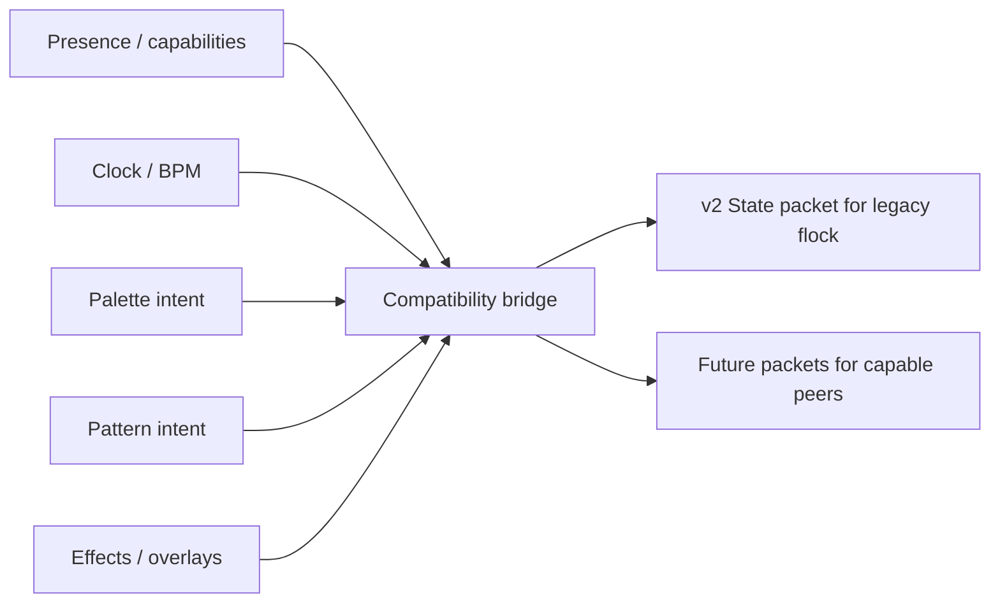

# Tubes Mesh Protocol

This document defines the Tubes mesh protocol that is already deployed in the
field. The protocol is the compatibility contract. WLED Tubes is the current
reference implementation, but future implementations should be able to interoperate
by following this document rather than by copying WLED internals.

The current deployed protocol is **Tubes Mesh Protocol v2**.

## Compatibility Contract

Tubes exist in a mixed fleet. Some devices can be updated immediately, some can be
updated with effort, and some may never be updated but can still rejoin a flock at
future events.

Protocol compatibility therefore means:

- Existing v2 packets must keep their byte layout and semantic meaning.
- Existing command IDs, pattern IDs, palette IDs, sync modes, effect modes, pen
  modes, action keys, and role values must not be repurposed.
- Newer devices may add a future protocol, but must continue to speak v2 when a
  legacy v2 device is nearby.
- In a mixed flock, v2 `State` remains the shared visual contract.
- Future-only features should be additive: side-channel beacons, extension packets,
  capability-gated commands, or dual-broadcast behavior.

## Protocol Layers

The Tubes protocol is carried over ESP-NOW broadcasts today, but the logical
protocol is a mesh envelope plus a command payload.

Transport requirements:

| Attribute | v2 value |
|---|---|
| Delivery model | Local broadcast |
| Addressing model | Mesh node IDs inside the payload |
| Reliability | Best effort |
| Ordering | Not guaranteed |
| Encryption | None at the Tubes protocol layer |
| Current carrier | ESP-NOW broadcast to `ff:ff:ff:ff:ff:ff` |
| Current v2 packet length | 84 bytes |

## Encoding Rules

All v2 numeric values are little-endian. The current protocol came from raw ESP32
C++ struct serialization, so v2 includes padding and reserved bytes. Those bytes are
part of the on-wire format.

Rules for non-WLED implementations:

- Send exactly 84 bytes for a v2 Tubes mesh packet.
- Read and write little-endian integers.
- Set known reserved bytes to zero when generating packets.
- Ignore reserved bytes when receiving packets.
- Keep all payload fields at their documented offsets.
- Leave unused bytes in the 64-byte command payload as zero.

## Mesh Envelope

Every v2 Tubes mesh packet uses this 84-byte envelope:

| Byte offset | Size | Name | Type | Meaning |
|---:|---:|---|---|---|
| 0 | 2 | `senderId` | `u16le` | Mesh ID of the node that transmitted this packet. |
| 2 | 2 | `senderUplinkId` | `u16le` | Mesh ID the sender follows, or `0` if none. |
| 4 | 1 | `protocolVersion` | `u8` | Must be `2` for this protocol. |
| 5 | 1 | `headerReserved` | `u8` | Reserved. Ignore on receive. Send as `0`. |
| 6 | 2 | `reservedA` | `u16` | Reserved alignment bytes. Ignore on receive. Send as `0`. |
| 8 | 4 | `recipients` | `u32le` | Routing class. See Recipient Classes. |
| 12 | 4 | `timebase` | `u32le` | Sender's clock reference in milliseconds. |
| 16 | 1 | `command` | `u8` | Command ID. |
| 17 | 64 | `payload` | bytes | Command-specific payload. |
| 81 | 3 | `trailerReserved` | bytes | Reserved alignment bytes. Ignore on receive. Send as `0`. |

## Node Identity

Each device chooses a `senderId`. Higher IDs dominate lower IDs in the current
leader-election behavior.

| Field | Meaning |
|---|---|
| `senderId` | The sender's current mesh ID. |
| `senderUplinkId` | The ID this sender currently follows. `0` means the sender has no uplink. |
| `protocolVersion` | The sender's mesh protocol version. Current deployed packets use `2`. |

Current ID conventions:

| Device class | ID range or value |
|---|---|
| Normal ESP32 v2 tubes | Random `256..3999` |
| Some S2/S3/C3 builds with `LOLIN_WIFI_FIX` | Random `10..254` |
| Master-role nodes | High ID, commonly `3850 + role` |
| Compile-time master variants | Often forced to `0xFFF` |

If a node receives a packet with its own `senderId`, it treats that as an ID
collision and chooses a new ID.

## Recipient Classes

`recipients` is a 4-byte little-endian value.

| Value | Name | Meaning |
|---:|---|---|
| 0 | `All` | Downstream visual/state message. Followers accept only from their uplink. |
| 1 | `Root` | Upstream request. Nodes accept only from direct downlinks. |
| 2 | `Info` | Broadcast informational message. All nodes may accept. |

Recipient acceptance:



## Mesh Behavior

The mesh is intentionally simple:

- Nodes follow the highest-ID node they can hear.
- A follower treats its chosen higher-ID node as its uplink.
- Followers accept `All` messages only from their uplink.
- Upstream commands from followers use `Root`.
- Nodes that appear to be on a path between lower-ID devices and a leader may
  rebroadcast messages for a short period.

### Following

A node switches uplink when it hears a sender whose ID is greater than both:

- the node's own ID, and
- the node's current uplink ID.

If a follower hears from its current uplink, it refreshes a 20-second uplink
timeout. If that timeout expires, the node unfollows and becomes independent until
it hears a higher-ID node again.

### Rebroadcast

Rebroadcast is used to extend range through the flock.

A node enters rebroadcast mode for about 30 seconds when it hears evidence that a
lower-ID node is below it in the mesh. While in that mode, it may retransmit accepted
non-`Info` packets after replacing the packet header with its own node ID and uplink
ID.



## Timebase

`timebase` is a 32-bit millisecond clock reference. Its purpose is to let receivers
align LED animation timing across devices.

Sender behavior:

```text
timebase = local_effect_timebase + local_millis
```

Receiver behavior:

```text
candidate_timebase = packet.timebase - local_millis + transport_delay_allowance
if abs(candidate_timebase - local_effect_timebase) > jitter_threshold:
    local_effect_timebase = candidate_timebase
```

The deployed implementation uses:

| Name | Value |
|---|---:|
| `transport_delay_allowance` | 3 ms |
| `jitter_threshold` | 10 ms |

## Command Registry

| Command ID | Name | Payload | Payload bytes used | Purpose |
|---:|---|---|---:|---|
| `0x10` | `Options` | `OptionsPayload` | 14 | Brightness and debug options. |
| `0x20` | `State` | `StatePayload` | 48 | Core visual state. |
| `0x30` | `Action` | `ActionPayload` | 2 | Small control actions. |
| `0x40` | `Info` | `InfoPayload` | 41 | Human-readable status/info. |
| `0x50` | `Beats` | `BeatsPayload` | 2 | BPM request. |
| `0xE0` | `Upgrade` | `UpgradePayload` | variable | Update offer. Not reliable in current v2 implementation. |
| `0xF0` | `Reset` | none | 0 | Reserved/defined, not currently handled. |

Unknown command IDs must be ignored. They should not change visible output.

## State Command

`State` is the core visual protocol. It carries the sender's current visual state
and a scheduled next visual state.



Payload layout:

| Payload offset | Size | Name | Type | Meaning |
|---:|---:|---|---|---|
| 0 | 24 | `current` | `VisualState` | State that should be active now. |
| 24 | 24 | `next` | `VisualState` | Scheduled upcoming state. |
| 48 | 16 | unused | bytes | Leave as zero. |

### VisualState

| Offset | Size | Name | Type | Meaning |
|---:|---:|---|---|---|
| 0 | 2 | `bpm` | `u16le` | BPM in unsigned 8.8 fixed point. |
| 2 | 2 | `reservedA` | bytes | Alignment/reserved. Ignore on receive. |
| 4 | 4 | `beatFrame` | `u32le` | Beat counter in 24.8 fixed point. |
| 8 | 2 | `patternPhrase` | `u16le` | Phrase when this pattern became/becomes active. |
| 10 | 1 | `patternId` | `u8` | Pattern registry ID. |
| 11 | 1 | `syncMode` | `u8` | Sync-mode registry ID. |
| 12 | 2 | `palettePhrase` | `u16le` | Phrase when this palette became/becomes active. |
| 14 | 1 | `paletteId` | `u8` | Palette registry ID. |
| 15 | 1 | `reservedB` | bytes | Alignment/reserved. Ignore on receive. |
| 16 | 2 | `effectPhrase` | `u16le` | Phrase when this effect became/becomes active. |
| 18 | 1 | `effectMode` | `u8` | Effect-mode registry ID. |
| 19 | 1 | `penMode` | `u8` | Pen-mode registry ID. |
| 20 | 1 | `beatPulse` | `u8` | Beat-pulse bit mask or `0` for continuous. |
| 21 | 1 | `effectChance` | `u8` | Probability threshold. |
| 22 | 2 | `reservedC` | bytes | Tail padding/reserved. Ignore on receive. |

### Clock Fields

`bpm` is unsigned 8.8 fixed point:

| Example | Meaning |
|---:|---|
| `0x7800` | 120.00 BPM |
| `0x7D00` | 125.00 BPM |
| `0x787F` | About 120.50 BPM |

`beatFrame` is unsigned 24.8 fixed point:

| Expression | Meaning |
|---|---|
| `beatFrame >> 8` | Whole beat count |
| `beatFrame & 0xff` | Fraction within beat |
| `beatFrame >> 12` | 16-beat phrase number |
| `(beatFrame >> 8) % 16` | Beat index inside the current phrase |

### Sync Mode Registry

| Value | Name | Visual meaning |
|---:|---|---|
| 0 | `All` | Use the shared beat frame directly. |
| 1 | `SinDrift` | Add a small sinusoidal drift. |
| 2 | `Pulse` | Pulse brightness over time. |
| 3 | `Swing` | Apply swing/easing to the beat. |
| 4 | `SwingDrift` | Swing plus sinusoidal drift. |

### Pattern Registry

`patternId` selects a protocol pattern, not merely a WLED effect number. The ID binds together a visual family, an implementation renderer, and the intent parameters that Tubes uses when choosing patterns.

The `Duration` and `Energy` values are part of the protocol vocabulary because they are how repeated-looking entries become distinct variants. Some IDs intentionally share the same renderer and parameters; those rows are weighting variants that bias random pattern selection while still preserving stable on-wire IDs.

| Duration | Value | Meaning |
|---|---:|---|
| `ExtraShortDuration` | 0 | very fast / momentary |
| `ShortDuration` | 10 | short-lived |
| `MediumDuration` | 20 | normal cadence |
| `LongDuration` | 30 | lingering |
| `ExtraLongDuration` | 40 | very slow / persistent |

| Energy | Value | Meaning |
|---|---:|---|
| `Boring` | 0 | calm / low motion |
| `Chill` | 10 | default medium-low energy |
| `MediumEnergy` | 20 | medium activity |
| `HighEnergy` | 230 | intense / event-like |

| ID | Family | Renderer | Duration | Energy | Variant |
|---:|---|---|---|---|---|
| 0 | Noise | Internal | `ShortDuration` | `Chill` | Short / Chill weighting 1 of 4 |
| 1 | Noise | Internal | `ShortDuration` | `Chill` | Short / Chill weighting 2 of 4 |
| 2 | Noise | Internal | `MediumDuration` | `Chill` | Medium / Chill weighting 1 of 6 |
| 3 | Noise | Internal | `MediumDuration` | `Chill` | Medium / Chill weighting 2 of 6 |
| 4 | Noise | Internal | `MediumDuration` | `Chill` | Medium / Chill weighting 3 of 6 |
| 5 | Noise | Internal | `LongDuration` | `Chill` | Long / Chill weighting 1 of 4 |
| 6 | Noise | Internal | `LongDuration` | `Chill` | Long / Chill weighting 2 of 4 |
| 7 | Confetti | Internal | `ShortDuration` | `Chill` | Short / Chill weighting 1 of 2 |
| 8 | Confetti | Internal | `MediumDuration` | `Chill` | Medium / Chill weighting 1 of 2 |
| 9 | Juggle | Internal | `ShortDuration` | `Chill` | Short / Chill weighting 1 of 2 |
| 10 | Noise | Internal | `ShortDuration` | `Chill` | Short / Chill weighting 3 of 4 |
| 11 | Noise | Internal | `ShortDuration` | `Chill` | Short / Chill weighting 4 of 4 |
| 12 | Noise | Internal | `MediumDuration` | `Chill` | Medium / Chill weighting 4 of 6 |
| 13 | Noise | Internal | `MediumDuration` | `Chill` | Medium / Chill weighting 5 of 6 |
| 14 | Noise | Internal | `MediumDuration` | `Chill` | Medium / Chill weighting 6 of 6 |
| 15 | Noise | Internal | `LongDuration` | `Chill` | Long / Chill weighting 3 of 4 |
| 16 | Noise | Internal | `LongDuration` | `Chill` | Long / Chill weighting 4 of 4 |
| 17 | Confetti | Internal | `ShortDuration` | `Chill` | Short / Chill weighting 2 of 2 |
| 18 | Confetti | Internal | `MediumDuration` | `Chill` | Medium / Chill weighting 2 of 2 |
| 19 | Juggle | Internal | `ShortDuration` | `Chill` | Short / Chill weighting 2 of 2 |
| 20 | Palette wave | Internal | `ShortDuration` | `Boring` | Short / Boring |
| 21 | Palette wave | Internal | `MediumDuration` | `Boring` | Medium / Boring |
| 22 | BPM palette | Internal | `ShortDuration` | `Chill` | Short / Chill |
| 23 | BPM palette | Internal | `MediumDuration` | `HighEnergy` | Medium / High |
| 24 | Fade | WLED FX 12 | `ShortDuration` | `Boring` | Short / Boring |
| 25 | Chase rainbow | WLED FX 30 | `MediumDuration` | `HighEnergy` | Medium / High |
| 26 | Aurora | WLED FX 38 | `MediumDuration` | `Boring` | Medium / Boring |
| 27 | Gradient | WLED FX 46 | `ShortDuration` | `Chill` | Short / Chill |
| 28 | Fairy twinkle | WLED FX 51 | `LongDuration` | `Chill` | Long / Chill |
| 29 | Running dual | WLED FX 52 | `ExtraShortDuration` | `Boring` | Extra short / Boring |
| 30 | Dual Larson scanner | WLED FX 60 | `MediumDuration` | `Chill` | Medium / Chill |
| 31 | Juggle | WLED FX 64 | `MediumDuration` | `Chill` | Medium / Chill |
| 32 | Palette | WLED FX 65 | `ShortDuration` | `Chill` | Short / Chill |
| 33 | Fire 2012 | WLED FX 66 | `MediumDuration` | `Chill` | Medium / Chill weighting 1 of 2 |
| 34 | BPM | WLED FX 68 | `MediumDuration` | `Chill` | Medium / Chill |
| 35 | Fill noise | WLED FX 69 | `LongDuration` | `Chill` | Long / Chill |
| 36 | Noise 2 | WLED FX 71 | `MediumDuration` | `Chill` | Medium / Chill |
| 37 | Noise 3 | WLED FX 72 | `ShortDuration` | `Chill` | Short / Chill |
| 38 | Noise 3 | WLED FX 72 | `LongDuration` | `MediumEnergy` | Long / Medium |
| 39 | Color twinkle | WLED FX 74 | `MediumDuration` | `Chill` | Medium / Chill |
| 40 | Lake | WLED FX 75 | `ShortDuration` | `Chill` | Short / Chill |
| 41 | Lake | WLED FX 75 | `MediumDuration` | `Chill` | Medium / Chill |
| 42 | Lake | WLED FX 75 | `LongDuration` | `Chill` | Long / Chill |
| 43 | Meteor smooth | WLED FX 77 | `MediumDuration` | `Chill` | Medium / Chill |
| 44 | Starburst | WLED FX 89 | `ExtraShortDuration` | `HighEnergy` | Extra short / High |
| 45 | Exploding fireworks | WLED FX 90 | `ExtraShortDuration` | `Chill` | Extra short / Chill |
| 46 | Sinelon dual | WLED FX 93 | `MediumDuration` | `Chill` | Medium / Chill |
| 47 | Popcorn | WLED FX 95 | `ShortDuration` | `MediumEnergy` | Short / Medium |
| 48 | Plasma | WLED FX 97 | `ShortDuration` | `Chill` | Short / Chill |
| 49 | Plasma | WLED FX 97 | `LongDuration` | `Chill` | Long / Chill |
| 50 | Pacifica | WLED FX 101 | `ShortDuration` | `Chill` | Short / Chill |
| 51 | Pacifica | WLED FX 101 | `LongDuration` | `Chill` | Long / Chill |
| 52 | Twinkleup | WLED FX 106 | `LongDuration` | `Chill` | Long / Chill |
| 53 | Noise palette | WLED FX 107 | `LongDuration` | `Chill` | Long / Chill |
| 54 | Phased noise | WLED FX 109 | `MediumDuration` | `Chill` | Medium / Chill |
| 55 | Flow | WLED FX 110 | `ShortDuration` | `Chill` | Short / Chill weighting 1 of 3 |
| 56 | Flow | WLED FX 110 | `ShortDuration` | `Chill` | Short / Chill weighting 2 of 3 |
| 57 | Flow | WLED FX 110 | `ShortDuration` | `Chill` | Short / Chill weighting 3 of 3 |
| 58 | Flow | WLED FX 110 | `MediumDuration` | `Chill` | Medium / Chill weighting 1 of 2 |
| 59 | Flow | WLED FX 110 | `MediumDuration` | `Chill` | Medium / Chill weighting 2 of 2 |
| 60 | Flow | WLED FX 110 | `LongDuration` | `Chill` | Long / Chill |
| 61 | Flow | WLED FX 110 | `ExtraLongDuration` | `Chill` | Extra long / Chill |
| 62 | Fire 2012 | WLED FX 66 | `ShortDuration` | `Chill` | Short / Chill |
| 63 | Fire 2012 | WLED FX 66 | `MediumDuration` | `Chill` | Medium / Chill weighting 2 of 2 |
| 64 | Phased noise | WLED FX 109 | `ShortDuration` | `Chill` | Short / Chill |

Implementations do not have to use WLED effect IDs internally, but they must preserve the semantics of each `patternId` when participating in the legacy mesh. If a renderer is unavailable, the closest local renderer should be chosen by family, duration, energy, and variant intent.

### Palette Registry

`paletteId` selects a palette by stable protocol ID. Palette names are advisory; the ID and descriptor are the wire contract.

Descriptor syntax for gradient palettes is `@position #RRGGBB`, where `position` is a stop from `0` to `255`. IDs `0` through `5` are dynamic or local palettes, IDs `6` through `12` are fixed built-in palettes, and IDs `13` through `128` are Tubes gradient palettes with explicit stop descriptors.

| ID | Name | Descriptor |
|---:|---|---|
| 0 | Default | Effect default or locally selected palette; no fixed gradient descriptor |
| 1 | * Random Cycle | Runtime-generated random palette; descriptor is intentionally unstable |
| 2 | * Color 1 | Solid Color 1 |
| 3 | * Colors 1&2 | Color 1 to Color 2 gradient |
| 4 | * Color Gradient | Color 3 to Color 2 to Color 1 gradient |
| 5 | * Colors Only | Discrete local color blocks from configured colors |
| 6 | Party | Fixed FastLED Party palette |
| 7 | Cloud | Fixed FastLED Cloud palette |
| 8 | Lava | Fixed FastLED Lava palette |
| 9 | Ocean | Fixed FastLED Ocean palette |
| 10 | Forest | Fixed FastLED Forest palette |
| 11 | Rainbow | Fixed FastLED Rainbow palette |
| 12 | Rainbow Bands | Fixed FastLED Rainbow Bands palette |
| 13 | July | @0 #E2060C; @94 #1A604E; @132 #82BD5E; @255 #B10309 |
| 14 | Vintage 57 | @0 #1D0803; @53 #4C0100; @104 #8E601C; @153 #D3BF3D; @255 #75812A |
| 15 | Vintage 01 | @0 #291218; @51 #490016; @76 #A5AA26; @101 #FFBD50; @127 #8B3828; @153 #490016; @229 #291218; @255 #291218 |
| 16 | Rivendell | @0 #18452C; @101 #496946; @165 #818C61; @242 #C8CCA6; @255 #C8CCA6 |
| 17 | RGI 15 | @0 #290E63; @31 #80184A; @63 #E32232; @95 #841F4C; @127 #2F1D66; @159 #6D2F65; @191 #B04264; @223 #813968; @255 #54306C |
| 18 | Retro | @0 #DEBF08; @255 #753401 |
| 19 | Analogous | @0 #2600FF; @63 #5600FF; @127 #8B00FF; @191 #C40075; @255 #FF0000 |
| 20 | Pink Splash 08 | @0 #BA3FFF; @127 #E30955; @175 #EACDD5; @221 #CD26B0; @255 #CD26B0 |
| 21 | Pink Splash 07 | @0 #E50101; @61 #F2043F; @101 #FF0CFF; @127 #F951FC; @153 #FF0BEB; @193 #F40544; @255 #E80105 |
| 22 | Coral Reef | @0 #28C7C5; @50 #0A989B; @96 #016F78; @96 #2B7FA2; @139 #0A496F; @255 #012247 |
| 23 | Ocean Breeze 68 | @0 #649C99; @51 #016389; @101 #014454; @104 #238EA8; @178 #003F75; @255 #010A0A |
| 24 | Ocean Breeze 36 | @0 #103033; @89 #1BA6AF; @153 #C5E9FF; @255 #009198 |
| 25 | Departure | @0 #352200; @42 #563300; @63 #936C31; @84 #D4A66C; @106 #EBD4B4; @116 #FFFFFF; @138 #BFFFC1; @148 #54FF58; @170 #00FF00; @191 #00C000; @212 #008000; @255 #008000 |
| 26 | Landscape 64 | @0 #000000; @37 #1F5913; @76 #48B22B; @127 #96EB05; @128 #BAEA77; @130 #DEE9FC; @153 #C5DBE7; @204 #84B3FD; @255 #1C6BE1 |
| 27 | Landscape 33 | @0 #0C2D00; @19 #655602; @38 #CF8004; @63 #F3C512; @66 #6DC492; @255 #052707 |
| 28 | Sherbet | @0 #FF6629; @43 #FF8C5A; @86 #FF335A; @127 #FF99A9; @170 #FFFFF9; @209 #71FF55; @255 #9DFF89 |
| 29 | Hult 65 | @0 #FBD8FC; @48 #FFC0FF; @89 #EF5FF1; @160 #3399D9; @216 #18B8AE; @255 #18B8AE |
| 30 | Hult 64 | @0 #18B8AE; @66 #08A296; @104 #7C8907; @130 #B2BA16; @150 #7C8907; @201 #069C90; @239 #008075; @255 #008075 |
| 31 | Drywet | @0 #776121; @42 #EBC758; @84 #A9EE7C; @127 #25EEE8; @170 #0778EC; @212 #1B01AF; @255 #043365 |
| 32 | IB15 | @0 #B1A0C7; @72 #CD9E95; @89 #E99B65; @107 #FF5F3F; @141 #C0626D; @255 #84659F |
| 33 | Fuschia | @0 #2B0399; @63 #640467; @127 #BC0542; @191 #A10B73; @255 #8714B6 |
| 34 | Emerald Dragon 08 | @0 #61FF01; @101 #2F8501; @178 #0D2B01; @255 #020A01 |
| 35 | Hot Lava | @0 #000000; @46 #4D0000; @96 #B10000; @108 #C42609; @119 #D74C13; @146 #EB731D; @174 #FF9929; @188 #FFB229; @202 #FFCC29; @218 #FFE629; @234 #FFFF29; @244 #FFFF8F; @255 #FFFFFF |
| 36 | Fire | @0 #010100; @76 #200500; @146 #C01800; @197 #DC6905; @240 #FCFF1F; @250 #FCFF6F; @255 #FFFFFF |
| 37 | Hiyane | @0 #24C5A4; @122 #24C5A4; @124 #010101; @135 #010101; @136 #EFF1F0; @177 #EFF1F0; @178 #010101; @204 #010101; @205 #546458; @229 #546458; @230 #010101; @253 #010101; @255 #EFF1F0 |
| 38 | Colorfull | @0 #3D9B2C; @25 #5FAE4D; @60 #84C171; @93 #9AA67D; @106 #AF8A88; @109 #B77989; @113 #C2688A; @116 #E1B3A5; @124 #FFFFC0; @168 #A7DACB; @255 #54B6D7 |
| 39 | Magenta Evening | @0 #471B27; @31 #820B33; @63 #D50240; @70 #E80142; @76 #FC0145; @108 #7B0233; @255 #2E0923 |
| 40 | Pink Purple | @0 #4F206D; @25 #5A2875; @51 #66307C; @76 #8D87B9; @102 #B4DEF8; @109 #D0ECFC; @114 #EDFAFF; @122 #CEC8EF; @149 #B195DE; @183 #BB82CB; @255 #C66FB8 |
| 41 | Sunset | @0 #B50000; @22 #DA5500; @51 #FFAA00; @85 #D3554D; @135 #A700A9; @198 #4900BC; @255 #0000CF |
| 42 | Autumn | @0 #5A0E05; @51 #8B290D; @84 #B44611; @104 #C0CA7D; @112 #B18903; @122 #BEC883; @124 #C0CA7C; @135 #B18903; @142 #C2CB76; @163 #B14411; @204 #80230C; @249 #4A0502; @255 #4A0502 |
| 43 | Blue/Magenta/White | @0 #000000; @42 #000075; @84 #0000FF; @127 #7100FF; @170 #FF00FF; @212 #FF80FF; @255 #FFFFFF |
| 44 | Blue/Magenta/Red | @0 #000000; @63 #710075; @127 #FF00FF; @191 #FF0075; @255 #FF0000 |
| 45 | Blue/Red/Yellow | @0 #000000; @42 #710000; @84 #FF0000; @127 #FF0075; @170 #FF00FF; @212 #FF8075; @255 #FFFF00 |
| 46 | Blue/Cyan/Yellow | @0 #0000FF; @63 #0080FF; @127 #00FFFF; @191 #71FF75; @255 #FFFF00 |
| 47 | Sunset Yellow | @0 #3D87B8; @36 #81BCA9; @87 #CBF19B; @100 #E4ED8D; @107 #FFE87F; @115 #FBCA82; @120 #F8AC85; @128 #FBCA82; @180 #FFE87F; @223 #FFF278; @255 #FFFC71 |
| 48 | Cloud | @0 #F7955B; @127 #D02047; @255 #2A4FBC |
| 49 | Fire & Ice | @0 #500201; @51 #CE0F01; @101 #F22201; @153 #104380; @204 #021545; @255 #010204 |
| 50 | BHW2 | @0 #02B8BC; @33 #381BA2; @66 #381BA2; @122 #FFFF2D; @150 #E34106; @201 #430D1B; @255 #100135 |
| 51 | Rainfall | @0 #C07603; @36 #C07603; @36 #DE7618; @72 #DE7618; @72 #E0D125; @109 #E0D125; @109 #3A9F2B; @145 #3A9F2B; @145 #078534; @182 #078534; @182 #047632; @218 #047632; @218 #015508; @255 #015508 |
| 52 | Angel | @0 #8544C5; @51 #020121; @101 #322382; @153 #C7E1ED; @204 #29BBE4; @255 #8544C5 |
| 53 | Butterfly | @0 #010106; @51 #060B34; @89 #6B6BC0; @127 #65A1C0; @165 #6B6BC0; @204 #060B34; @255 #000000 |
| 54 | 250K Meters | @0 #FFFFFF; @11 #FFFFFF; @11 #FFFCD6; @34 #FFFCD6; @34 #FFF8B2; @57 #FFF8B2; @57 #FFD382; @81 #FFD382; @81 #FFB059; @115 #FFB059; @115 #FF933F; @173 #FF933F; @173 #FF7F37; @255 #FF7F37 |
| 55 | Night Midnight | @0 #0F191B; @36 #16305B; @59 #2050CB; @74 #6E9AE4; @77 #FFFFFF; @82 #6E9AE4; @96 #2050CB; @189 #051249; @255 #00010C |
| 56 | Afterdusk | @0 #000000; @25 #010101; @48 #010101; @67 #293134; @70 #D2DBD8; @73 #9B7389; @81 #6D2E4E; @86 #6D2E4E; @97 #6D2E4E; @165 #320F4F; @255 #100150 |
| 57 | Blue Sky | @0 #010727; @25 #021958; @61 #0935A0; @88 #2E73C9; @102 #78CBF5; @108 #58A9E6; @124 #3F8BD8; @216 #1560CB; @255 #023CBC |
| 58 | Gold Orange | @0 #F4580B; @21 #F7761A; @40 #F99832; @62 #FCC952; @72 #FFFF7D; @79 #FFD377; @83 #FFA970; @87 #FFD377; @94 #FFFF7D; @103 #F4CF36; @118 #EDA410; @202 #F27C0D; @255 #F4580B |
| 59 | Frizell 10 | @0 #2D4440; @11 #2D4440; @11 #F28E0A; @25 #F28E0A; @25 #010506; @38 #010506; @39 #D2BD77; @49 #D2BD77; @49 #4F1901; @63 #4F1901; @65 #D2BD77; @76 #D2BD77; @77 #891300; @255 #891300 |
| 60 | Frizell 12 | @0 #2D4440; @2 #D2BD77; @24 #D2BD77; @25 #010506; @126 #010506; @126 #891300; @228 #891300; @230 #4F1901; @253 #4F1901; @255 #F28E0A |
| 61 | Fib 18 | @0 #49B81F; @179 #49B81F; @179 #010101; @192 #010101; @193 #013801; @205 #013801; @205 #EFF1F0; @216 #EFF1F0; @217 #017901; @229 #017901; @230 #010101; @243 #010101; @243 #E3E78C; @255 #E3E78C |
| 62 | Fib 13 | @0 #063DF0; @101 #063DF0; @101 #EFF1F0; @127 #EFF1F0; @128 #010101; @152 #010101; @153 #EFF1F0; @178 #EFF1F0; @178 #063DF0; @202 #063DF0; @203 #EFF1F0; @229 #EFF1F0; @230 #010101; @253 #010101; @255 #EFF1F0 |
| 63 | Fib 17 | @0 #E3E78C; @2 #010101; @12 #010101; @13 #49B81F; @76 #49B81F; @77 #010101; @89 #010101; @89 #017901; @166 #017901; @166 #010101; @179 #010101; @179 #013801; @241 #013801; @241 #010101; @252 #010101; @255 #E3E78C |
| 64 | Fib 05 | @0 #EFF1F0; @23 #EFF1F0; @25 #EF7266; @51 #EF7266; @51 #6272F0; @75 #6272F0; @77 #EF72F0; @99 #EF72F0; @101 #627266; @125 #627266; @127 #62F1F0; @152 #62F1F0; @153 #010101; @178 #010101; @179 #62F1F0; @204 #62F1F0; @205 #EFF1F0; @255 #EFF1F0 |
| 65 | Analogous 02 | @0 #20007B; @63 #6E054F; @127 #FF172D; @191 #FF151E; @255 #FF1212 |
| 66 | Analogous 04a | @0 #4337FF; @42 #4337FF; @84 #4337FF; @84 #7821FF; @127 #7821FF; @170 #7821FF; @170 #FF172D; @212 #FF172D; @255 #FF172D |
| 67 | Cyan Orange | @0 #016CD4; @60 #016CD4; @121 #016CD4; @121 #000000; @124 #000000; @127 #000000; @127 #E57F0F; @188 #F2BA5C; @248 #FFFFFF; @248 #000000; @251 #000000; @255 #000000 |
| 68 | C/W/G | @0 #00FFFF; @63 #2AFFFF; @127 #FFFFFF; @191 #2AFF2D; @255 #00FF00 |
| 69 | Wild Orange | @0 #000000; @0 #900B01; @0 #900B01; @5 #900B01; @10 #C22401; @30 #FC4F01; @86 #F9AF64; @106 #F47A19; @124 #ED4F01; @157 #F49A02; @196 #FCFF05; @209 #FCDF03; @239 #FF6C01; @255 #FF2401 |
| 70 | Ikat Radial | @0 #030704; @56 #FFFFFF; @127 #030704; @196 #FFFFFF; @255 #030704 |
| 71 | Citrus | @0 #FCA405; @63 #951903; @135 #FFA609; @201 #932703; @255 #ED7704 |
| 72 | Teal Blue | @0 #014958; @63 #012B34; @127 #014D5F; @196 #013A43; @255 #012D32 |
| 73 | Ldby Orange | @0 #D92D11; @61 #B31508; @130 #DE3115; @193 #CB2007; @255 #AD1606 |
| 74 | Purple/Orange | @0 #351B5B; @36 #351B5B; @36 #79376F; @72 #79376F; @72 #B36B89; @109 #B36B89; @109 #B3BDB6; @145 #B3BDB6; @145 #EA983B; @182 #EA983B; @182 #E35C0B; @218 #E35C0B; @218 #A52801; @255 #A52801 |
| 75 | Blue/Tan | @0 #074DD2; @31 #074DD2; @31 #1570D8; @63 #1570D8; @63 #3595CF; @95 #3595CF; @95 #7BB4C0; @127 #7BB4C0; @127 #BABA7F; @159 #BABA7F; @159 #B69F32; @191 #B69F32; @191 #9B750E; @223 #9B750E; @223 #734802; @255 #734802 |
| 76 | Green/Purple | @0 #015A0C; @36 #015A0C; @36 #0C9333; @72 #0C9333; @72 #38BD78; @109 #38BD78; @109 #B3BDB6; @145 #B3BDB6; @145 #B36B89; @182 #B36B89; @182 #79376F; @218 #79376F; @218 #351B5B; @255 #351B5B |
| 77 | Knoza 00 | @0 #3838ED; @1 #730101; @24 #730101; @25 #ED822E; @101 #EDBA01; @113 #EDBA01; @115 #020101; @138 #020101; @139 #EDBA01; @153 #EDBA01; @228 #ED822E; @229 #730101; @253 #730101; @255 #3838ED |
| 78 | Knoza 18 | @0 #080101; @2 #01EF01; @51 #01EF01; @52 #AF8201; @100 #AF8201; @101 #010101; @115 #010101; @117 #EDEFED; @138 #EDEFED; @139 #010101; @153 #010101; @153 #AF8201; @203 #AF8201; @203 #01EF01; @252 #01EF01; @255 #080101 |
| 79 | Calpan | @0 #851F89; @1 #750258; @24 #750258; @25 #EFF1F5; @32 #EFF1F5; @51 #EFF1F5; @53 #750258; @76 #750258; @77 #851F89; @255 #EFF1F5 |
| 80 | Calbayo | @0 #D28301; @60 #D28301; @62 #290203; @99 #290203; @100 #6A2801; @101 #D28301; @126 #D28301; @127 #D21F06; @165 #D21F06; @166 #D28301; @188 #D28301; @191 #030606; @226 #030606; @228 #D28301; @253 #D28301; @255 #013A1D |
| 81 | Fib53 | @0 #EF0B1F; @101 #EF0B1F; @101 #EFF1F0; @127 #EFF1F0; @128 #010101; @152 #010101; @153 #EFF1F0; @178 #EFF1F0; @179 #EF0B1F; @202 #EF0B1F; @203 #EFF1F0; @229 #EFF1F0; @230 #010101; @253 #010101; @255 #EFF1F0 |
| 82 | Purple/Orange | @0 #311A59; @31 #311A59; @31 #6B316A; @63 #6B316A; @63 #A5587F; @95 #A5587F; @95 #BC979E; @127 #BC979E; @127 #D2B275; @159 #D2B275; @159 #EF8725; @191 #EF8725; @191 #DC5107; @223 #DC5107; @223 #9F2501; @255 #9F2501 |
| 83 | PMH | @0 #FF3791; @42 #FF3791; @42 #FFB691; @84 #FFB691; @84 #FFFF69; @127 #FFFF69; @127 #ABFFAE; @170 #ABFFAE; @170 #65FFD4; @212 #65FFD4; @212 #AB52D4; @255 #AB52D4 |
| 84 | Konjo 08 | @0 #D5E5F0; @127 #D5E5F0; @128 #85A8BC; @150 #85A8BC; @150 #15395B; @152 #000621; @177 #000621; @179 #000209; @200 #000209; @203 #000621; @227 #000621; @229 #1E0002; @252 #1E0002; @255 #000621 |
| 85 | Konikyo | @0 #010209; @101 #010209; @102 #C7D5FC; @122 #C7D5FC; @126 #010209; @151 #010209; @151 #1880F5; @177 #1880F5; @178 #010209; @203 #010209; @203 #B18501; @229 #B18501; @229 #010209; @252 #010209; @255 #010209 |
| 86 | McCahon | @0 #ED5F1D; @61 #F7E9BE; @63 #6D4901; @125 #F7E9BE; @127 #BA1405; @190 #F7E9BE; @191 #030101; @255 #ED5F1D |
| 87 | Pills | @0 #C0930B; @127 #94683B; @255 #6D459B |
| 88 | Pink/Yellow/Orange | @0 #FFC700; @34 #FF7900; @106 #FF3F00; @168 #C20D06; @255 #920125 |
| 89 | Autumn 04 | @0 #020101; @101 #1B0100; @165 #D21601; @234 #FFA62A; @255 #FFA62A |
| 90 | Autumn 02 | @0 #560601; @127 #FFFF7D; @153 #FFFF7D; @242 #C26001; @255 #C26001 |
| 91 | Candide | @0 #F2F4F2; @63 #85FF89; @127 #F292C2; @191 #68BBF5; @252 #E8EFED; @255 #E8EFED |
| 92 | Chic | @0 #040101; @51 #876303; @63 #DEF8A0; @76 #6E7632; @89 #483706; @127 #040101; @165 #483706; @172 #5A5416; @178 #6E7632; @191 #DEF8A0; @204 #876303; @247 #040101; @255 #040101 |
| 93 | Coffee | @0 #98AD7B; @13 #989A6A; @25 #96885B; @63 #854E23; @86 #702E0F; @114 #560F01; @153 #440601; @178 #2E0101; @191 #1F0101; @216 #0E0100; @255 #060100 |
| 94 | Emerald Dragon 01 | @0 #010101; @79 #011307; @130 #013B19; @229 #1CFFFF; @255 #1CFFFF |
| 95 | Landscape 57 | @0 #1B5B00; @89 #7EAB6A; @91 #9DC7FF; @143 #2D8EF5; @191 #0360EB; @255 #010F16 |
| 96 | Landscape 22 | @0 #010601; @38 #073101; @63 #157C01; @68 #ADF4FC; @127 #0AA49C; @255 #054442 |
| 97 | Landscape 47 | @0 #AF7D2C; @38 #582D03; @58 #2E1B01; @76 #140E00; @79 #F9C18C; @255 #791B01 |
| 98 | Landscape 10 | @0 #F4D537; @24 #F2D135; @51 #EDCB33; @63 #D2FCFC; @89 #ABE1E6; @127 #7BDDCB; @204 #197A90; @255 #0A5D73 |
| 99 | Landscape 76 | @0 #FCB252; @127 #D05B07; @132 #99ADBC; @191 #A3BBDD; @255 #82BFFA |
| 100 | Landscape 61 | @0 #5AC701; @89 #49DB06; @127 #22BD06; @128 #71DD4B; @130 #FFFCFF; @178 #40BDFF; @255 #017AFF |
| 101 | Landscape 60 | @0 #A17012; @51 #824E01; @89 #5F3B01; @91 #85978C; @136 #165C5B; @178 #013134; @242 #000101; @255 #000101 |
| 102 | Landscape 51 | @0 #808067; @39 #A5A190; @76 #CEC3BE; @114 #0F47F7; @178 #010947; @255 #01010A |
| 103 | Landscape 06 | @0 #5AC701; @89 #ADF4FC; @255 #39AFCF |
| 104 | Ocean Breeze 49 | @0 #B8E7FA; @76 #0070CB; @77 #1DA8E4; @79 #B3EBFF; @153 #40BDFF; @255 #007CC7 |
| 105 | Ocean Breeze 57 | @0 #735231; @76 #573316; @79 #F94709; @101 #F97A11; @140 #F77926; @178 #AF7D47; @229 #7B6C53; @255 #536153 |
| 106 | Ocean Breeze 74 | @0 #010101; @101 #221703; @127 #351A02; @130 #CB4107; @153 #4E3808; @191 #16250B; @255 #010401 |
| 107 | Pink Splash 05 | @0 #CE0119; @20 #C02D52; @38 #B3B6B6; @76 #CE0119; @127 #FF87FC; @178 #CE0119; @216 #B3B6B6; @231 #C02D52; @255 #CE0119 |
| 108 | Pink Splash 10 | @0 #1A111B; @63 #B80125; @76 #EA8DAE; @89 #940223; @127 #1A111B; @252 #5A4159; @255 #5A4159 |
| 109 | Vintage 56 | @0 #DCE1DD; @51 #534F07; @109 #190001; @119 #FF8313; @127 #D9DDB8; @135 #FF8313; @145 #190001; @204 #3C2E01; @255 #DCE1DD |
| 110 | Vintage 10 | @0 #010301; @51 #070101; @127 #701200; @255 #CECFB6 |
| 111 | Gold/Yellow | @0 #000000; @94 #2A1D00; @189 #FF8700; @213 #FFBD04; @238 #FFFF19; @246 #FFFF67; @255 #FFFFFF |
| 112 | Radioactive Slime | @0 #000000; @25 #010401; @58 #011301; @76 #041E04; @101 #112B0D; @118 #0C450D; @135 #08640D; @150 #1B9224; @174 #3BC74B; @195 #87C34F; @222 #FFBD54; @239 #FFDD60; @255 #FFFF6F |
| 113 | Pastel Rainbow | @0 #000000; @33 #010208; @67 #070C2D; @88 #1B121F; @110 #431B13; @129 #532634; @147 #643567; @168 #5A605D; @189 #4F9C53; @206 #6EB284; @222 #94CBC5; @238 #C5E3DF; @255 #FFFFFF |
| 114 | Purple Sunset | @0 #000000; @31 #010101; @62 #010107; @62 #030206; @63 #060405; @88 #100809; @114 #1F0E0F; @131 #2D1616; @148 #3D1F1F; @152 #412725; @155 #45302D; @192 #76562E; @225 #B8872F; @238 #C5A148; @255 #D5BB67 |
| 115 | Adrift in Dreams | @0 #94DF4D; @51 #94DF4D; @51 #56B659; @102 #56B659; @102 #248348; @153 #248348; @153 #053D33; @204 #053D33; @204 #010F1D; @255 #010F1D |
| 116 | Set3 | @0 #36A889; @84 #36A889; @84 #FFFF69; @170 #FFFF69; @170 #767FAC; @255 #767FAC |
| 117 | Pastel1 | @0 #F47662; @42 #F47662; @42 #659DBE; @84 #659DBE; @84 #8ED585; @127 #8ED585; @127 #B19AC0; @170 #B19AC0; @170 #FCB257; @212 #FCB257; @212 #FFFF91; @255 #FFFF91 |
| 118 | Es Rosa | @0 #060102; @101 #36010A; @170 #0F1D04; @216 #5F7C36; @255 #D5E99E |
| 119 | Daybreak | @0 #010101; @91 #040B15; @140 #0B1F87; @150 #FFFF7D; @165 #84127B; @198 #3A5CDD; @232 #39A8DF; @255 #FFF1F2 |
| 120 | Melancholiy | @0 #FFABF2; @76 #010269; @140 #79887D; @211 #FFABF2; @255 #010269 |
| 121 | Xanidu | @0 #76A1E2; @5 #FFFF2D; @15 #FCCB9C; @53 #4F01A2; @94 #430107; @132 #01379C; @173 #017F3D; @211 #272D48; @255 #76A1E2 |
| 122 | Air | @0 #FCF667; @84 #FCF667; @140 #0E015B; @155 #A5B09C; @163 #FCF667; @170 #0E015B; @181 #A5B09C; @193 #FCF667; @255 #FCF667 |
| 123 | Revolution | @0 #702E15; @33 #65450E; @61 #C24A1D; @91 #F27334; @119 #D7D366; @145 #020201; @163 #081C2E; @186 #110901; @229 #D7D366; @255 #F27334 |
| 124 | Sky05 | @0 #FC3D02; @25 #FF9204; @63 #E0FFFF; @101 #2E72E2; @127 #06287F; @191 #010311; @255 #010104 |
| 125 | Sky33 | @0 #EDE58C; @51 #E36B4F; @87 #9B3736; @178 #161C24; @255 #05131F |
| 126 | Sky45 | @0 #F9CD04; @51 #FFEF7B; @87 #058D55; @178 #011A2B; @255 #000217 |
| 127 | Carousel | @0 #020625; @101 #020625; @122 #B17909; @127 #D99502; @132 #B17909; @153 #540D24; @255 #540D24 |
| 128 | NRWC | @0 #010101; @25 #040801; @51 #010B02; @76 #042409; @102 #064212; @127 #1B5F17; @153 #527F1F; @178 #C5AB28; @204 #856413; @229 #613006; @255 #A33707 |

A future protocol may transmit a literal gradient descriptor as an overlay command, but the legacy `paletteId` should continue to resolve to these descriptors so older Tubes see the same color intent.

### Effect Registry

`effectMode`:

| Value | Name | Visual meaning |
|---:|---|---|
| 0 | `None` | No overlay effect. |
| 1 | `Glitter` | Small sparkles. |
| 2 | `Bubble` | Pop/bubble particle. |
| 3 | `Beatbox1` | Beatbox particle burst. |
| 4 | `Beatbox2` | Larger beatbox particle burst. |
| 5 | `Spark` | Moving spark particle. |
| 6 | `Flash` | Flash overlay. |

`penMode`:

| Value | Name | Visual meaning |
|---:|---|---|
| 0 | `Draw` | Draw the effect color. |
| 1 | `Erase` | Erase/darken target pixels. |
| 2 | `Blend` | Blend effect color with existing output. |
| 3 | `Invert` | Invert target pixels. |
| 4 | `White` | Force white. |
| 5 | `Black` | Force black. |
| 6 | `Brighten` | Brighten target pixels. |
| 7 | `Darken` | Darken target pixels. |
| 8 | `Flicker` | Flicker/dither effect. |

`beatPulse`:

| Value | Name | Meaning |
|---:|---|---|
| 0 | `Continuous` | Effect may run continuously. |
| 1 | `Eighth` | Trigger on eighth-beat pulse. |
| 2 | `Quarter` | Trigger on quarter-beat pulse. |
| 4 | `Half` | Trigger on half-beat pulse. |
| 8 | `Beat` | Trigger on beat pulse. |
| 16 | `TwoBeats` | Trigger every two beats. |
| 32 | `Measure` | Trigger every measure. |
| 64 | `TwoMeasures` | Trigger every two measures. |
| 128 | `Phrase` | Trigger every phrase. |

`effectChance` is a probability threshold from `0..255`. The deployed behavior
triggers when a random byte is less than or equal to `effectChance`.

## Options Command

`Options` controls simple fleet-wide device options.

Payload layout:

| Payload offset | Size | Name | Type | Meaning |
|---:|---:|---|---|---|
| 0 | 1 | `debugging` | `u8 bool` | Nonzero enables debug display behavior. |
| 1 | 1 | `brightness` | `u8` | Target brightness. |
| 2 | 12 | `reserved` | bytes | Reserved. Send zero; ignore on receive. |
| 14 | 50 | unused | bytes | Leave as zero. |

## Action Command

`Action` carries a compact operator command.

Payload layout:

| Payload offset | Size | Name | Type | Meaning |
|---:|---:|---|---|---|
| 0 | 1 | `key` | ASCII byte | Action key. |
| 1 | 1 | `arg` | `u8` | Action argument. |
| 2 | 62 | unused | bytes | Leave as zero. |

Action registry:

| Key | Arg | Meaning |
|---|---|---|
| `A` | ignored | Turn on access point / visible admin mode. |
| `O` | 0/1 | Disable/enable sound overlay. |
| `X` | ignored | Reboot if selected. |
| `R` | role | Set role if selected. |
| `@` | 0/1 | Set power-save mode. |
| `W` | ignored | Clear Wi-Fi client credentials. |
| `G` | ignored | Add glitter locally. |
| `F` | hue | Flash all LEDs using the hue. |
| `M` | ignored | Cancel manual WLED override mode. |
| `*` | ignored | Enter selection window. |
| `(` | ignored | Enter selection window. |
| `)` | ignored | Exit selection/update-ready mode. |
| `V` | version | Select node for update if local version is older. |
| `U` | ignored | Start update if selected. |

Unrecognized action keys must be ignored.

## Info Command

Payload layout:

| Payload offset | Size | Name | Type | Meaning |
|---:|---:|---|---|---|
| 0 | 1 | `status` | `u8` | Status code. |
| 1 | 40 | `message` | bytes | Human-readable text, normally null-terminated. |
| 41 | 23 | unused | bytes | Leave as zero. |

`Info` is informational and should not change visual state.

## Beats Command

`Beats` is a request to change BPM.

Payload layout:

| Payload offset | Size | Name | Type | Meaning |
|---:|---:|---|---|---|
| 0 | 2 | `bpm` | `u16le` | BPM in 8.8 fixed point. |
| 2 | 62 | unused | bytes | Leave as zero. |

Typical routing:

- Followers send `Beats` as `Root`.
- A root or capable relay updates the clock and then emits a normal `State`.
- Master-role devices may ignore `Beats` if they use their own beat source.

## Upgrade Command

`Upgrade` is reserved for update offers. It is defined in the deployed command
registry but is not a reliable interoperability surface in current v2.

Future update protocols should treat update control as an extension channel and keep
v2 `State`/`Action` behavior independent of it.

## Reset Command

`Reset` is reserved. No v2 payload or behavior is currently defined.

## Role Registry

Roles are local device behavior values, currently used by some actions and local
configuration.

| Value | Name | Meaning |
|---:|---|---|
| 0 | `UnknownRole` | Uninitialized or unknown. |
| 10 | `DefaultRole` | Power-saving default role. |
| 50 | `CampRole` | Non-power-saving camp role. |
| 100 | `InstallationRole` | Installed/powered role. |
| 120 | `SmallArtRole` | Smaller display/scaled art role. |
| 190 | `LegacyRole` | Legacy half-pixel role. |
| 200 | `MasterRole` | Master/controller role. |

## Normal Cadence

The protocol is event-plus-heartbeat based.



Current v2 cadence conventions:

| Event | Cadence |
|---|---|
| State heartbeat | Every 2000 ms from non-followers |
| Follower state heartbeat | About one out of four 2000 ms periods |
| Uplink loss timeout | 20000 ms |
| Rebroadcast window | 30000 ms |
| Startup broadcast delay | `3000 - senderId / 2` ms |
| Phrase length | 16 beats |

## WiZ Remote Side Protocol

The same ESP-NOW receive path also accepts WiZ remote packets. These are not Tubes
mesh packets, do not use the 84-byte Tubes envelope, and are not rebroadcast as
mesh packets.

WiZ packet fields recognized by the current implementation:

| Offset | Size | Name | Expected value / meaning |
|---:|---:|---|---|
| 0 | 1 | `program` | `0x91` for ON, `0x81` for others. |
| 1 | 4 | `seq` | Little-endian sequence number. Duplicates ignored. |
| 5 | 1 | `byte5` | Must be `32`. |
| 6 | 1 | `button` | WiZ button ID. |
| 7 | 1 | `byte8` | Must be `1`. |
| 8 | 1 | `byte9` | Must be `100`. |
| 9 | 4 | `tail` | Unknown/checksum bytes. |

Recognized buttons:

| Button | Meaning |
|---:|---|
| 1 | Turn on AP/debug and acknowledge. |
| 2 | Turn off AP/Wi-Fi/debug and acknowledge. |
| 3 | Master only: chill/120 BPM and force next. |
| 8 | Brightness down. |
| 9 | Brightness up. |
| 16 | Master only: choose a non-`All` sync pattern. |
| 17 | Master only: choose a non-empty effect. |
| 18 | Master only: 125 BPM and fire pattern. |
| 19 | Master only: force pattern 38. |

## Future Extension Shape

Future protocols should be parallel and negotiable.

Recommended channel split:



Recommended migration behavior:

- Send future capability beacons at low cadence.
- Continue to send v2 `State` while any legacy v2 node is heard.
- Use hysteresis before entering or leaving future-only mode.
- In mixed mode, translate future state back into v2 `VisualState`.
- Never require old nodes to understand new fields to preserve the core flock.

# WLED Tubes Reference Implementation

This section documents the current WLED implementation details. These details
explain why the deployed v2 wire format looks the way it does, but the protocol
definition above is the interop contract.

## Source Locations

| Area | File |
|---|---|
| Mesh protocol and routing | `usermods/Tubes/node.h` |
| Visual state and command IDs | `usermods/Tubes/global_state.h` |
| Controller send/receive behavior | `usermods/Tubes/controller.h` |
| Pattern registry | `usermods/Tubes/pattern.h` |
| Effect registry | `usermods/Tubes/effects.h` |
| ESP-NOW sidecar transport | `wled00/espnow_broadcast.{h,cpp}` |
| Palette registry override | `wled00/palettes_tubes.h`, `wled00/FX_fcn.cpp` |

## Implementation Encoding Notes

The WLED implementation currently sends native C++ objects directly:

- `NodeMessage` is under `#pragma pack(push,4)`.
- `MessageRecipients` is a default enum, so it is 4 bytes.
- `MeshNodeHeader` is 6 bytes because of tail padding.
- `NodeMessage` is 84 bytes.
- `TubeState` is 24 bytes.
- `TubeStates` is 48 bytes.

The implementation initializes the 64-byte `data` array to zero before copying the
command payload into it. Padding bytes should not be interpreted.

## Current Implementation Hazards

These are not ideal protocol properties, but they are true of the deployed WLED
implementation and must be considered during refactors.

### Version Filtering

The WLED receiver filter accepts `NodeMessage` only when:

```text
packet length == 84
packet.protocolVersion == local protocol version
```

Current local protocol version is `2`. A future protocol version must not simply
replace v2 unless it also keeps receiving and sending v2 for legacy nodes.

### State Payload Adjacency

The intended `State` payload is `current VisualState` followed by `next
VisualState`. The current sender implementation broadcasts 48 bytes starting at the
`current_state` member and relies on `current_state` and `next_state` being adjacent
members in `PatternController`.

Refactors must preserve the payload layout even if the implementation stops relying
on member adjacency.

### Info Broadcast Bug

`broadcast_info(NodeInfo *info)` currently passes the address of the pointer rather
than the `NodeInfo` payload. Treat `Info` as a defined packet shape, but do not rely
on the current WLED helper until this is corrected compatibly.

### Upgrade Payload Size

The `Upgrade` command refers to `AutoUpdateOffer`, but that struct may exceed the
64-byte command payload depending on platform ABI. The current update path is not a
stable mesh protocol surface.

### Palette IDs

Current Tubes builds modify WLED's fixed palette registry to include Tubes palettes.
Future implementations may move those palettes into WLED custom/usermod/runtime
slots, but the mesh `paletteId` must remain Tubes palette intent, not WLED runtime
slot identity.

## WLED Rendering Mapping

The current WLED implementation maps protocol pattern IDs to either internal
virtual-strip patterns or WLED FX modes.

| Pattern IDs | Rendering strategy |
|---|---|
| 0..23 | Tubes virtual-strip functions. |
| 24..64 | WLED FX selected through `gPatterns`. |

The implementation currently composites via `handleOverlayDraw()` and
`VirtualStrip`. Future WLED versions may render the same protocol state through
native WLED segments, layers, or FX, as long as the visible meaning of v2 state is
preserved.

## WLED Serial Commands That Emit Mesh Messages

The serial console is not part of the mesh protocol, but it is a common operator
surface for producing mesh traffic.

| Serial command | Mesh effect |
|---|---|
| `b###` | Request/set BPM. Followers send `Beats`; roots update and broadcast `State`. |
| `s` | Start phrase and broadcast `State`. |
| `n` | Force next scheduled change and broadcast `State`. |
| `p###` | Set next pattern ID and broadcast `State`. |
| `m###` | Set next sync mode and broadcast `State`. |
| `c###` | Set next palette ID and broadcast `State`. |
| `e###` | Set next effect from the WLED `gEffects` table and broadcast `State`. |
| `%###` | Set effect chance and broadcast `State`. |
| `U`, `V`, `*`, `(`, `)`, `@`, `G`, `A`, `W`, `X`, `F`, `R`, `M` | Broadcast `Action`. |
| `O` | Broadcast sound-overlay `Action`. |
| `P` | Broadcasts an action key that current `onAction()` does not handle. |

Local-only commands include debug toggle, local reboot, local role set, local AP
control, and local ID reset.
